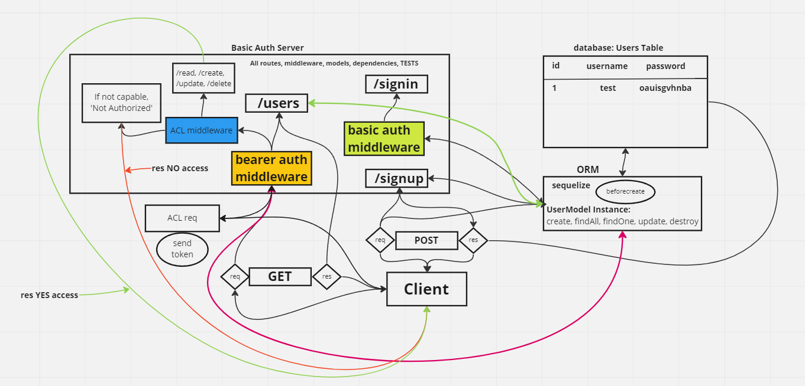

# auth-api (Lab 08)

## Project: Template API buildout w/ Classes

### Author: Tyler Bennett

### Problem Domain  

Basic API Server template w/Classes.

### Links and Resources

- [ci/cd](https://github.com/tyler-bennett52/project-tracker/actions) (GitHub Actions)
- [back-end server url](https://project-tracker-uka9.onrender.com) (when applicable)

### Setup

#### `.env` requirements (where applicable)

DATABASE_URL requires a postgres DB url

#### How to initialize/run your application (where applicable)

- `node index.js`

#### How to use your library (where applicable)

#### Features / Routes

/projects - GET & POST projects/:id - GET & POST & DELETE

#### Tests

npm test

#### UML & WRRC

#### Attribution

Built from starter code
